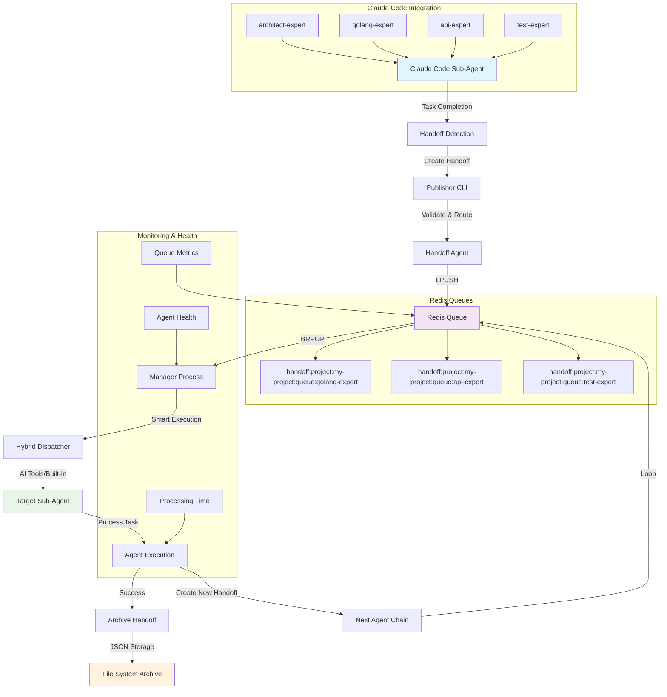

# Agent Handoff System

A Redis-based agent orchestration system that enables sophisticated inter-agent communication and task management for Claude Code workflows.

## Overview

The Agent Handoff System consists of three main components, each compiled into a distinct binary:

1.  **`handoff-agent`**: The central server that manages routing, validation, and monitoring.
2.  **`manager`**: A zero-configuration worker process with hybrid execution modes and built-in agent intelligence.
3.  **`publisher`**: A command-line tool to create and publish new handoffs.

Together, they provide real-time queue management, intelligent routing, schema validation, and comprehensive monitoring for agent-to-agent workflows across multiple projects with zero setup requirements.

## Execution Modes

The enhanced manager supports three intelligent execution strategies:


### Built-in Agent Mode
```bash
manager --mode executor --agent project-manager --payload-file task.json
```
- **Native Intelligence**: Go-based implementations with real analysis capabilities
- **Available Agents**: project-manager, architect-expert, agent-manager
- **No External Dependencies**: Pure Go implementations with comprehensive logic
- **Performance**: Sub-millisecond operation performance

###  Dispatcher Mode
```bash
manager --mode dispatcher
```
- **Backward Compatibility**: Maintains compatibility with existing `run-agent.sh` workflows
- **Script Integration**: Uses traditional script-based execution when needed
- **Migration Support**: Smooth transition path for existing deployments

## Quick Start

### Prerequisites

- Go 1.21 or later
- Docker and Docker Compose

### 1. Start Redis

```bash
docker-compose up -d redis
```

### 2. Build All Binaries

This command compiles `handoff-agent`, `manager`, and `publisher` into the `bin/` directory.

```bash
mkdir -p bin
(cd handoff && go build -o ../bin/handoff-agent ./cmd/main.go)
(cd agent-manager && go build -o ../bin/manager ./cmd/manager/main.go && go build -o ../bin/publisher ./cmd/publisher/main.go)
```

**🎯 Zero Configuration**: The enhanced manager binary now provides zero-configuration execution with intelligent tool detection and built-in agents. No project-specific setup required!

### 3. Run Background Services

From the project root, start the two main services.

```bash
# Add the tools to your current session's PATH
export PATH=$PWD/bin:$PATH

# Start the services in the background
handoff-agent &
manager &
```

### 4. Test with a Handoff

Navigate to any directory to simulate working on a different project.

```bash
# Create a temporary project folder and move into it
mkdir -p /tmp/my-test-project && cd /tmp/my-test-project

# Publish a handoff from within your project
publisher architect-expert api-expert "Design a new API"
```

You should see the `manager` service log that it picked up the task for `my-test-project`.

## System Architecture

### Components Overview

```
┌─────────────────┐    ┌─────────────────┐    ┌──────────────────┐
│    Publisher    │    │  Handoff Agent  │    │ Enhanced Manager │
│ (CLI Tool)      │───▶│ (Central Server)│───▶│ (Hybrid Modes)   │
│ - Create Handoff│    │ - Validate      │    │ - Queue Monitor  │
│ - Auto Project  │    │ - Route         │    │ - Tool Detection │
│ - Send to Redis │    │ - Monitor       │    │ - Built-in Agents│
└─────────────────┘    └─────────────────┘    └──────────────────┘
                                │                       │
                                ▼                       ▼
                       ┌─────────────────┐    ┌──────────────────┐
                       │     Redis       │    │ Smart Execution  │
                       │                 │    │                  │
                       │ - Message Queue │    │ - AI Tool Support│
                       │ - Metadata      │    │ - Native Agents  │
                       │ - Monitoring    │    │ - Zero Config    │
                       └─────────────────┘    └──────────────────┘
```

### Data Flow Diagram



### Data Flow

1. **Handoff Creation**: Agents or external systems create handoff messages
2. **Validation**: Handoff library validates schema and content
3. **Routing**: Messages are routed to appropriate agent queues
4. **Queuing**: Redis stores messages with priority ordering
5. **Processing**: Agent Manager monitors queues and dispatches work
6. **Execution**: Agents are executed via the bridge script
7. **Archival**: Completed handoffs are archived to filesystem

### Claude Code Integration

The agent handoff system seamlessly integrates with Claude Code's sub-agent architecture:

#### **Publishing Handoffs**
Claude Code sub-agents publish handoffs through multiple mechanisms:

```bash
# 1. CLI Publisher (from within projects)
publisher architect-expert golang-expert "Optimize the Redis connection pooling"

# 2. Task Tool Integration (automatic)
# When sub-agents complete tasks, they can automatically create handoffs
# to continue workflows across agent boundaries
```

#### **Queue Structure**
Each project gets isolated Redis queues:
```
handoff:project:{project_name}:queue:{agent_name}
handoff:project:my-app:queue:golang-expert
handoff:project:my-app:queue:api-expert
handoff:project:my-app:queue:test-expert
```

#### **Agent Orchestration Flow**
1. **architect-expert** → Designs system architecture
2. **golang-expert** → Implements backend code
3. **api-expert** → Creates API specifications
4. **test-expert** → Validates implementations
5. **devops-expert** → Handles deployment

Each agent automatically hands off to the next appropriate agent based on the workflow requirements.

## Deployment

The system now consists of three main binaries that need to be built and run:

- **`handoff-agent`**: The central server that manages routing, validation, and monitoring.
- **`manager`**: An enhanced worker process with hybrid execution modes, zero-configuration setup, and built-in agent intelligence. You can run multiple workers.
- **`publisher`**: A command-line tool to create and publish new handoffs with automatic project detection.

### 1. Build the Binaries

A `bin/` directory will be created in the project root to hold the compiled programs.

```bash
# Create the bin directory
mkdir -p bin

# Build the handoff-agent server
(cd handoff && go build -o ../bin/handoff-agent ./cmd/main.go)

# Build the manager and publisher tools
(cd agent-manager && go build -o ../bin/manager ./cmd/manager/main.go && go build -o ../bin/publisher ./cmd/publisher/main.go)
```

### 2. Configure Your Environment

For convenience, add the newly created `bin` directory to your system's PATH. This will allow you to run the `publisher` and other tools from any directory.

```bash
export PATH=$PWD/bin:$PATH
```

### 3. Run the System

First, ensure your Redis server is running.

```bash
docker-compose up -d redis
```

Next, start the two background services from the root of the `agent-handoff` project:

```bash
# Start the handoff-agent server in the background
handoff-agent &

# Start the agent manager worker in the background
manager &
```

The system is now running and ready to process handoffs with zero configuration required!

### 4. Enhanced Execution Modes

The manager now supports multiple execution strategies:

```bash
# Hybrid mode (default) - Automatic tool detection and intelligent execution
manager --mode hybrid

# Direct agent execution - Built-in agents with native Go implementations
manager --mode executor --agent project-manager --payload-file task.json

# Traditional dispatcher mode - Compatible with existing workflows
manager --mode dispatcher
```

**Key Benefits:**
- ✅ **Zero Setup**: Works immediately in any project directory
- ✅ **Tool Detection**: Automatically finds Claude Code, VS Code, Go, npm, Docker, etc.
- ✅ **Smart Fallbacks**: Uses best available tool with intelligent priority selection
- ✅ **Built-in Intelligence**: Native agent implementations with real analysis capabilities

## Configuration

### Agent Manager

The Agent Manager uses environment variables for configuration:

```bash
export REDIS_ADDR="localhost:6379"  # Redis connection string
```

As of the latest update, the Agent Manager in `main.go` no longer uses a static list of queues. It dynamically discovers and listens on all project-specific queues that match the pattern `handoff:project:*:queue:*`. This allows it to handle multiple projects concurrently without manual configuration for each new project.

### Handoff Library

Configuration via JSON file:

```json
{
  "redis": {
    "addr": "localhost:6379",
    "db": 0
  },
  "agents": [
    {
      "name": "golang-expert",
      "queue_name": "handoff:project:my-project:queue:golang-expert",
      "max_concurrent": 3
    }
  ],
  "monitoring": {
    "enabled": true,
    "interval": "30s"
  }
}
```

## Usage Examples

### Publishing Handoffs

To publish a handoff, use the `publisher` command-line tool from within your project's directory. The tool automatically detects the project name from your current working directory.

```bash
# Usage: publisher <from_agent> <to_agent> [message]
publisher architect-expert golang-expert "Implement user service"
```

### Programmatic Handoff Creation

```go
package main

import (
    "context"
    "encoding/json"
    "time"
    "github.com/go-redis/redis/v8"
)

type HandoffPayload struct {
    Metadata struct {
        ProjectName string    `json:"project_name"`
        FromAgent   string    `json:"from_agent"`
        ToAgent     string    `json:"to_agent"`
        Timestamp   time.Time `json:"timestamp"`
        TaskContext string    `json:"task_context"`
        Priority    string    `json:"priority"`
        HandoffID   string    `json:"handoff_id"`
    } `json:"metadata"`
    Content struct {
        Summary          string                 `json:"summary"`
        Requirements     []string               `json:"requirements"`
        Artifacts        map[string][]string    `json:"artifacts"`
        TechnicalDetails map[string]interface{} `json:"technical_details"`
        NextSteps        []string               `json:"next_steps"`
    } `json:"content"`
    Status    string    `json:"status"`
    CreatedAt time.Time `json:"created_at"`
    UpdatedAt time.Time `json:"updated_at"`
}

func publishHandoff(rdb *redis.Client, handoff HandoffPayload) error {
    ctx := context.Background()

    // Serialize handoff
    payload, err := json.Marshal(handoff)
    if err != nil {
        return err
    }

    // Store in Redis with TTL
    handoffKey := fmt.Sprintf("handoff:%s", handoff.Metadata.HandoffID)
    err = rdb.Set(ctx, handoffKey, payload, 24*time.Hour).Err()
    if err != nil {
        return err
    }

    // Add to priority queue for a specific project
    queueName := fmt.Sprintf("handoff:project:%s:queue:%s", handoff.Metadata.ProjectName, handoff.Metadata.ToAgent)
    score := 3.0 + float64(time.Now().UnixNano())/1e18 // Priority + timestamp

    return rdb.ZAdd(ctx, queueName, &redis.Z{
        Score:  score,
        Member: handoff.Metadata.HandoffID,
    }).Err()
}
```

### Agent Integration Pattern

To integrate with the handoff system, agents should:

1. **Listen to their queue**: The `manager` service monitors project-specific queues (e.g., `handoff:project:my-project:queue:agent-name`).
2. **Process handoffs**: The enhanced manager uses intelligent execution strategies:
   - **Tool Detection**: Automatically uses Claude Code, VS Code, or other available AI tools
   - **Built-in Agents**: Native Go implementations for core agents (project-manager, architect-expert, etc.)
   - **Script Fallback**: Compatible with existing `run-agent.sh` workflows when needed
3. **Update status**: The agent should report status back (e.g., by creating a subsequent handoff).
4. **Create new handoffs**: Chain to other agents by using the `publisher` tool or programmatic creation.

Example agent integration:

```bash
#!/bin/bash
# Custom agent script

HANDOFF_JSON="$1"
HANDOFF_ID=$(echo "$HANDOFF_JSON" | jq -r '.metadata.handoff_id')

# Process the handoff
echo "Processing handoff $HANDOFF_ID..."

# Your agent logic here
# - Parse requirements
# - Execute tasks
# - Generate artifacts
# - Create output

# Success
echo "✅ Agent completed successfully"
exit 0
```

## Handoff Schema

### Standard Schema

```yaml
metadata:
  project_name: string       # Name of the project context
  from_agent: string          # Source agent identifier
  to_agent: string            # Target agent identifier
  timestamp: datetime         # ISO8601 timestamp
  task_context: string        # Brief task description
  priority: enum              # low|normal|high|critical
  handoff_id: string          # Unique handoff identifier

content:
  summary: string             # Task summary
  requirements: string[]      # List of requirements
  artifacts:
    created: string[]         # Files created
    modified: string[]        # Files modified
    reviewed: string[]        # Files reviewed
  technical_details: object   # Agent-specific data
  next_steps: string[]        # Follow-up actions

status: string                # pending|processing|completed|failed
created_at: datetime          # Creation timestamp
updated_at: datetime          # Last update timestamp
```

### Agent-Specific Technical Details

**golang-expert**:
```yaml
technical_details:
  packages: string[]          # Go packages to create
  handlers: string[]          # HTTP handlers needed
  models: string[]            # Data structures
  test_coverage: number       # Target coverage %
```

**typescript-expert**:
```yaml
technical_details:
  components: string[]        # React components
  hooks: string[]             # Custom hooks
  types: string[]             # TypeScript definitions
  api_integration: boolean    # Needs API calls
```

**devops-expert**:
```yaml
technical_details:
  containers: string[]        # Docker containers
  services: string[]          # Kubernetes services
  environments: string[]      # Target environments
  monitoring: boolean         # Add monitoring
```

## Monitoring and Observability

### Queue Monitoring

Check queue depths for a specific project:

```bash
redis-cli ZCARD handoff:project:my-project:queue:golang-expert
redis-cli ZCARD handoff:project:my-project:queue:api-expert
```

View queued handoffs:

```bash
redis-cli ZRANGE handoff:project:my-project:queue:golang-expert 0 -1 WITHSCORES
```

### Archive Analysis

Completed handoffs are archived to `agent-manager/archive/` in project-specific directories:

```
archive/
└── my-project/
    ├── 2024-01-15/
    │   ├── 20240115T143022Z-api-expert-abc12345.json
    │   ├── 20240115T143545Z-golang-expert-def67890.json
    │   └── 20240115T144012Z-test-expert-ghi13579.json
    └── 2024-01-16/
        └── ...
```

Each file contains the complete handoff payload for audit and debugging.

### System Health

Monitor Agent Manager logs:

```bash
# Watch real-time processing
tail -f agent-manager.log

# Check for errors
grep ERROR agent-manager.log

# Monitor throughput
grep "SUCCESS" agent-manager.log | wc -l
```

## Development and Testing

### Running Tests

```bash
# Handoff library tests
cd handoff
go test ./...

# Agent Manager (manager) tests
cd agent-manager/cmd/manager
go test ./...

# Publisher tests
cd ../publisher
go test ./...

# Integration tests (requires Redis)
docker-compose up -d redis
go test -tags=integration ./...
```

### Development Workflow

1. **Start Redis**: `docker-compose up -d redis`
2. **Run Handoff Agent**: `handoff-agent &` (from project root after building)
3. **Run Enhanced Manager**: `manager &` (hybrid mode with zero configuration)
4. **Test with handoffs**: `publisher agent1 agent2 "test message"` (works from any project directory)
5. **Check archives**: `ls agent-manager/archive/$(date +%Y-%m-%d)/`

**Zero Configuration Benefits:**
- No need to copy `run-agent.sh` to every project
- Automatic tool detection (Claude Code, VS Code, etc.)
- Built-in agent intelligence for core workflows
- Intelligent fallback strategies for maximum compatibility


## Troubleshooting

### Common Issues

**Redis Connection Failed**
```bash
# Check Redis status
docker-compose ps redis

# Check connectivity
redis-cli ping
# Expected: PONG

# Restart if needed
docker-compose restart redis
```

**Agent Manager Not Processing**
```bash
# Check if queues have messages for a specific project
redis-cli ZCARD handoff:project:my-project:queue:api-expert

# Check Agent Manager logs
grep ERROR agent-manager.log

# Verify queue naming matches by scanning for all queues
redis-cli KEYS "handoff:project:*:queue:*"
```

**Handoffs Stuck in Processing**
```bash
# Check for failed executions
grep "FAILURE" agent-manager.log

# Manually inspect handoff data
redis-cli GET handoff:12345abc-def

# Clear stuck queues if needed
redis-cli DEL handoff:project:my-project:queue:problematic-agent
```

**Legacy Script Support** (Optional)
```bash
# For backward compatibility, run-agent.sh is still supported
# Make script executable if using legacy mode
chmod +x agent-manager/run-agent.sh

# Check script syntax
bash -n agent-manager/run-agent.sh
```

**Note**: The enhanced manager provides built-in execution capabilities, making `run-agent.sh` optional for most workflows.

### Debugging Tips

1. **Enable verbose logging** in `handoff-agent` or `manager`:
   ```bash
   handoff-agent -log-level debug &
   manager -log-level debug &
   ```

2. **Monitor Redis operations**:
   ```bash
   redis-cli MONITOR
   ```

3. **Validate handoff JSON**:
   ```bash
   echo "$PAYLOAD" | jq .
   ```

4. **Test agent execution**:
   ```bash
   # Test built-in agent execution (recommended)
   manager --mode executor --agent project-manager --payload-file test-handoff.json

   # Test legacy script execution (optional)
   cd agent-manager
   ./run-agent.sh test-expert '{"metadata":{"handoff_id":"test"}}'
   ```

### Performance Tuning

**Redis Optimization**:
- Use connection pooling
- Set appropriate memory limits
- Configure persistence settings

**Agent Manager Scaling**:
- Run multiple Agent Manager instances
- Distribute agents across instances
- Use Redis Cluster for high availability

**Queue Management**:
- Monitor queue depths regularly
- Adjust processing delays
- Implement priority-based processing

## Advanced Features

### Priority Handling

Handoffs support four priority levels:

- **Critical** (score: 1.x): Immediate processing
- **High** (score: 2.x): Expedited processing
- **Normal** (score: 3.x): Standard processing
- **Low** (score: 4.x): Background processing

Set priority in handoffs:

```go
handoff.Metadata.Priority = "high"
```

### Retry Logic

Failed handoffs can be automatically retried with exponential backoff:

```go
retryPolicy := RetryPolicy{
    MaxRetries:    3,
    InitialDelay:  time.Second,
    MaxDelay:      time.Minute,
    BackoffFactor: 2.0,
}
```

### Agent Routing

The handoff library supports intelligent routing based on content:

```go
router.AddRoute("api-expert", RouteRule{
    Name:        "route-go-implementation",
    TargetAgent: "golang-expert",
    Priority:    100,
    Conditions: []RouteCondition{{
        Field:    "technical_details.language",
        Operator: "equals",
        Value:    "go",
    }},
})
```

## Contributing

1. Fork the repository
2. Create a feature branch: `git checkout -b feature/amazing-feature`
3. Write tests for new functionality
4. Ensure all tests pass: `go test ./...`
5. Submit a pull request

### Code Style

- Follow Go conventions and `gofmt`
- Add comprehensive tests
- Document public APIs
- Use meaningful commit messages

## License

MIT License - see LICENSE file for details.
