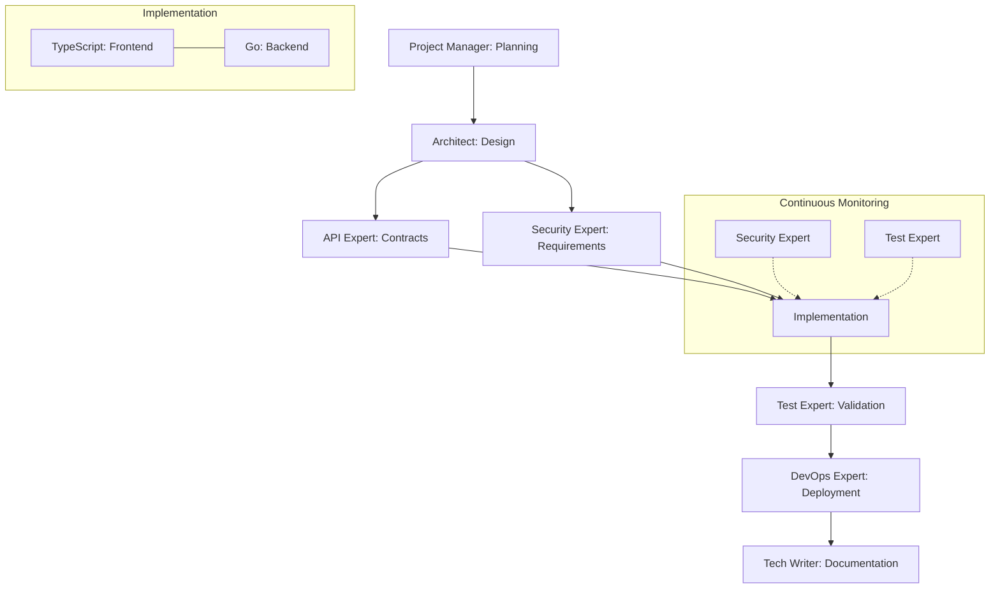
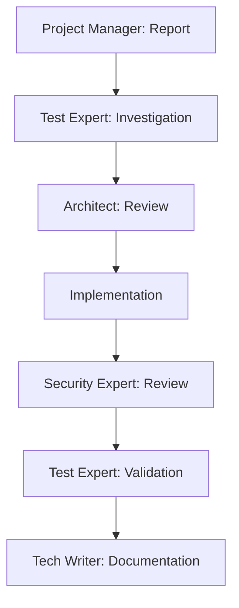

# Workflow System Guide

This document explains how the Claude Code workflow system works and how to use it effectively.

## Overview

The workflow system is not just documentation - it's an executable system that:
- Enforces valid workflow sequences
- Tracks workflow state
- Validates agent handoffs
- Ensures quality gates

## Workflow Registry

Each workflow is registered with the system:

```yaml
workflow_definition:
  name: string           # Workflow identifier
  description: string    # Purpose and scope
  stages: Stage[]        # Required stages
  validation: Rule[]     # Quality gates

stage_definition:
  name: string          # Stage name
  agent: string         # Required agent
  requires: string[]    # Required inputs
  provides: string[]    # Required outputs
  optional: boolean     # Can be skipped?
  parallel: boolean     # Can run in parallel?
```

## Standard Workflows

### Feature Implementation



#### Stage Definitions

1. **Planning**
   ```yaml
   stage:
     name: "Planning"
     agent: project-manager
     requires: []
     provides: 
       - requirements
       - priorities
   ```

2. **Architecture**
   ```yaml
   stage:
     name: "Architecture"
     agent: architect-expert
     requires: ["Planning"]
     provides:
       - architecture
       - patterns
   ```

3. **API Design**
   ```yaml
   stage:
     name: "API Design"
     agent: api-expert
     requires: ["Architecture"]
     provides:
       - api_contracts
     optional: true
   ```

4. **Security Planning**
   ```yaml
   stage:
     name: "Security Planning"
     agent: security-expert
     requires: ["Architecture"]
     provides:
       - security_requirements
   ```

5. **Implementation**
   ```yaml
   stage:
     name: "Frontend Implementation"
     agent: typescript-expert
     requires: 
       - "API Design"
       - "Security Planning"
     provides:
       - frontend_implementation
     parallel: true

   stage:
     name: "Backend Implementation"
     agent: golang-expert
     requires:
       - "API Design"
       - "Security Planning"
     provides:
       - backend_implementation
     parallel: true
   ```

6. **Testing**
   ```yaml
   stage:
     name: "Testing"
     agent: test-expert
     requires:
       - "Frontend Implementation"
       - "Backend Implementation"
     provides:
       - test_results
   ```

7. **Deployment**
   ```yaml
   stage:
     name: "Deployment"
     agent: devops-expert
     requires: ["Testing"]
     provides:
       - deployment_status
   ```

8. **Documentation**
   ```yaml
   stage:
     name: "Documentation"
     agent: tech-writer
     requires: ["Deployment"]
     provides:
       - documentation
   ```

### Bug Fix Workflow



#### Stage Definitions

1. **Report**
   ```yaml
   stage:
     name: "Report"
     agent: project-manager
     requires: []
     provides:
       - bug_report
   ```

2. **Investigation**
   ```yaml
   stage:
     name: "Investigation"
     agent: test-expert
     requires: ["Report"]
     provides:
       - root_cause
   ```

3. **Architecture Review**
   ```yaml
   stage:
     name: "Architecture Review"
     agent: architect-expert
     requires: ["Investigation"]
     provides:
       - fix_approach
   ```

4. **Implementation**
   ```yaml
   stage:
     name: "Implementation"
     agent: ["typescript-expert", "golang-expert"]
     requires: ["Architecture Review"]
     provides:
       - fix_implementation
   ```

5. **Security Review**
   ```yaml
   stage:
     name: "Security Review"
     agent: security-expert
     requires: ["Implementation"]
     provides:
       - security_validation
   ```

6. **Testing**
   ```yaml
   stage:
     name: "Testing"
     agent: test-expert
     requires: ["Security Review"]
     provides:
       - test_results
   ```

7. **Documentation**
   ```yaml
   stage:
     name: "Documentation"
     agent: tech-writer
     requires: ["Testing"]
     provides:
       - documentation
   ```

## Using Workflows

### Starting a Workflow

1. Select workflow type:
   ```yaml
   workflow: "feature_implementation"
   ```

2. Provide initial context:
   ```yaml
   context:
     task_id: string
     requirements: string[]
     priority: string
   ```

3. System validates and initiates:
   ```yaml
   workflow_state:
     id: string
     current_stage: "Planning"
     status: "active"
   ```

### Stage Transitions

1. Agent completes stage:
   ```yaml
   stage_completion:
     stage: string
     outputs: {}
     status: "completed"
   ```

2. System validates outputs:
   ```yaml
   validation:
     outputs_valid: boolean
     missing_outputs: string[]
     next_stages: string[]
   ```

3. Transition to next stage:
   ```yaml
   transition:
     from_stage: string
     to_stage: string
     context: {}
   ```

### Handoff Protocol

When transitioning between stages:

```yaml
handoff:
  metadata:
    workflow_id: string
    from_stage: string
    to_stage: string
    timestamp: string
  
  content:
    outputs: {}          # Stage outputs
    context: {}          # Workflow context
    requirements: {}     # Next stage needs
    validation: {}       # Output validation
```

## Best Practices

1. **Follow Workflow Order**
   - Don't skip required stages
   - Complete all required outputs
   - Validate transitions
   - Preserve context

2. **Handle Failures**
   - Validate inputs
   - Check prerequisites
   - Handle errors gracefully
   - Maintain state

3. **Monitor Progress**
   - Track workflow state
   - Monitor handoffs
   - Validate outputs
   - Check quality gates

4. **Maintain Context**
   - Preserve requirements
   - Track decisions
   - Document changes
   - Update state

## Quality Gates

Each workflow enforces quality gates:

1. **Stage Entry**
   - Required inputs available
   - Prerequisites met
   - Agent available
   - No conflicts

2. **Stage Completion**
   - All outputs provided
   - Quality standards met
   - Tests passing
   - Documentation updated

3. **Workflow Completion**
   - All stages completed
   - No open issues
   - Documentation complete
   - Quality verified