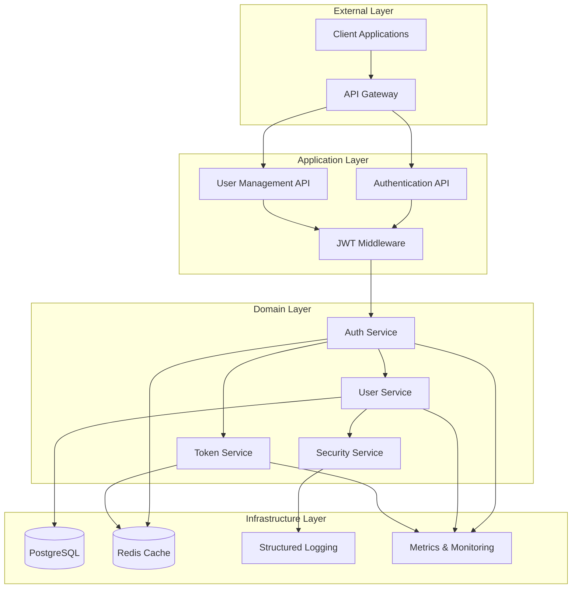
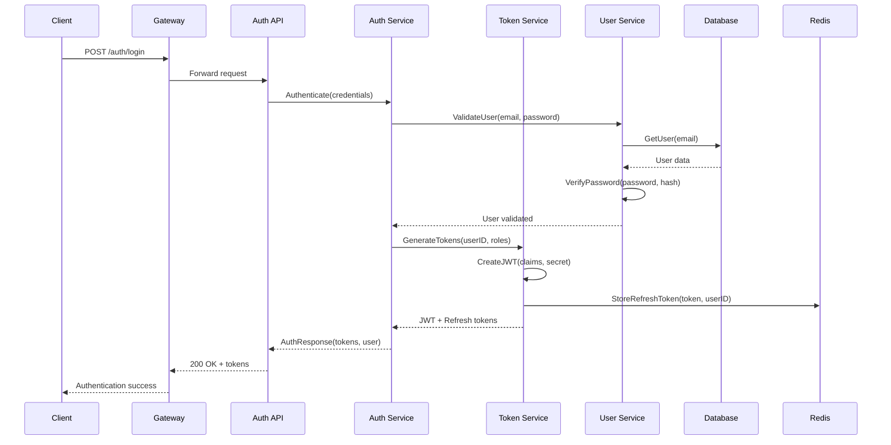
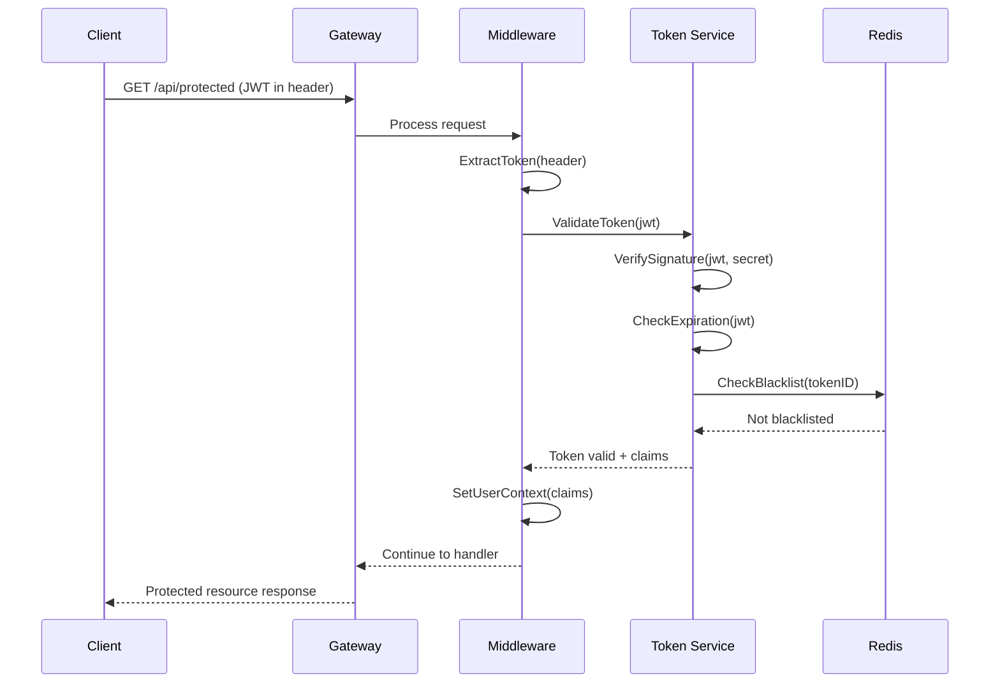
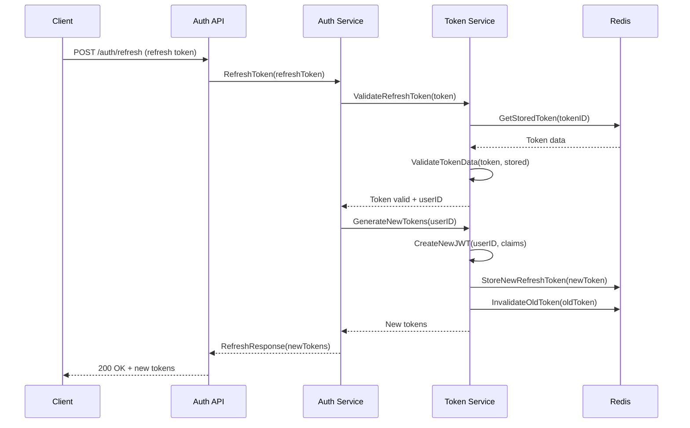
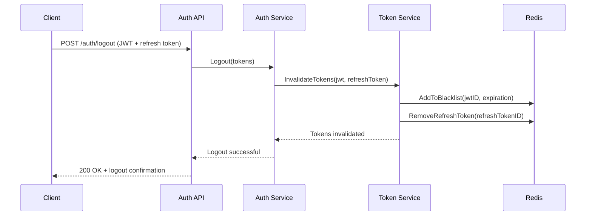

# JWT Authentication System Architecture Design

## System Overview

### Architecture Pattern Decision
```
PATTERN: Clean Architecture with Hexagonal Design
REASON: Testability and maintainability required
TRADEOFF: Initial complexity vs long-term flexibility
DECISION: Proceed with layered architecture
MONITOR: Component coupling metrics
```

### High-Level System Architecture



## Component Architecture

### 1. Authentication Service Design

```yaml
authentication_service:
  responsibilities:
    - JWT token generation and validation
    - Login/logout flow management
    - Token refresh mechanism
    - Session management
  
  interfaces:
    - AuthenticationRepository
    - TokenManager
    - SecurityValidator
    - AuditLogger
  
  patterns:
    - Repository pattern for data access
    - Strategy pattern for token algorithms
    - Factory pattern for token creation
    - Observer pattern for audit events
```

### 2. User Service Design

```yaml
user_service:
  responsibilities:
    - User registration and profile management
    - Password management with bcrypt
    - Account verification workflows
    - Role and permission management
  
  interfaces:
    - UserRepository
    - PasswordHasher
    - EmailService
    - ValidationService
  
  patterns:
    - Repository pattern for user data
    - Builder pattern for user creation
    - Strategy pattern for password hashing
    - Command pattern for user operations
```

### 3. Token Service Design

```yaml
token_service:
  responsibilities:
    - JWT token creation with claims
    - Token validation and parsing
    - Refresh token management
    - Blacklist/revocation handling
  
  interfaces:
    - TokenGenerator
    - TokenValidator
    - RefreshTokenStore
    - BlacklistManager
  
  patterns:
    - Factory pattern for token types
    - Strategy pattern for signing algorithms
    - Cache-aside pattern for blacklists
    - Template pattern for token validation
```

### 4. Security Service Design

```yaml
security_service:
  responsibilities:
    - Rate limiting per user/IP
    - Password strength validation
    - Brute force protection
    - Audit logging and monitoring
  
  interfaces:
    - RateLimiter
    - PasswordValidator
    - AuditLogger
    - ThreatDetector
  
  patterns:
    - Sliding window for rate limiting
    - Chain of responsibility for validation
    - Observer pattern for security events
    - Circuit breaker for protection
```

## Data Flow Architecture

### 1. Authentication Flow



### 2. Token Validation Flow



### 3. Token Refresh Flow



### 4. Logout Flow



## Database Schema Design

### User Management Schema

```sql
-- Users table with comprehensive user data
CREATE TABLE users (
    id UUID PRIMARY KEY DEFAULT gen_random_uuid(),
    email VARCHAR(255) UNIQUE NOT NULL,
    password_hash VARCHAR(255) NOT NULL,
    first_name VARCHAR(100),
    last_name VARCHAR(100),
    is_verified BOOLEAN DEFAULT FALSE,
    is_active BOOLEAN DEFAULT TRUE,
    created_at TIMESTAMP WITH TIME ZONE DEFAULT NOW(),
    updated_at TIMESTAMP WITH TIME ZONE DEFAULT NOW(),
    last_login_at TIMESTAMP WITH TIME ZONE,
    password_changed_at TIMESTAMP WITH TIME ZONE DEFAULT NOW()
);

-- Indexes for performance optimization
CREATE INDEX idx_users_email ON users(email);
CREATE INDEX idx_users_active ON users(is_active) WHERE is_active = TRUE;
CREATE INDEX idx_users_verified ON users(is_verified) WHERE is_verified = TRUE;

-- Roles and permissions for authorization
CREATE TABLE roles (
    id UUID PRIMARY KEY DEFAULT gen_random_uuid(),
    name VARCHAR(50) UNIQUE NOT NULL,
    description TEXT,
    created_at TIMESTAMP WITH TIME ZONE DEFAULT NOW()
);

CREATE TABLE permissions (
    id UUID PRIMARY KEY DEFAULT gen_random_uuid(),
    name VARCHAR(50) UNIQUE NOT NULL,
    resource VARCHAR(50) NOT NULL,
    action VARCHAR(50) NOT NULL,
    description TEXT,
    created_at TIMESTAMP WITH TIME ZONE DEFAULT NOW()
);

CREATE TABLE role_permissions (
    role_id UUID REFERENCES roles(id) ON DELETE CASCADE,
    permission_id UUID REFERENCES permissions(id) ON DELETE CASCADE,
    PRIMARY KEY (role_id, permission_id)
);

CREATE TABLE user_roles (
    user_id UUID REFERENCES users(id) ON DELETE CASCADE,
    role_id UUID REFERENCES roles(id) ON DELETE CASCADE,
    assigned_at TIMESTAMP WITH TIME ZONE DEFAULT NOW(),
    assigned_by UUID REFERENCES users(id),
    PRIMARY KEY (user_id, role_id)
);
```

### Session and Token Tracking Schema

```sql
-- Refresh tokens for secure token management
CREATE TABLE refresh_tokens (
    id UUID PRIMARY KEY DEFAULT gen_random_uuid(),
    user_id UUID NOT NULL REFERENCES users(id) ON DELETE CASCADE,
    token_hash VARCHAR(255) NOT NULL,
    device_info JSONB,
    ip_address INET,
    user_agent TEXT,
    expires_at TIMESTAMP WITH TIME ZONE NOT NULL,
    created_at TIMESTAMP WITH TIME ZONE DEFAULT NOW(),
    last_used_at TIMESTAMP WITH TIME ZONE DEFAULT NOW(),
    is_revoked BOOLEAN DEFAULT FALSE
);

-- Indexes for token management
CREATE INDEX idx_refresh_tokens_user_id ON refresh_tokens(user_id);
CREATE INDEX idx_refresh_tokens_expires_at ON refresh_tokens(expires_at);
CREATE INDEX idx_refresh_tokens_active ON refresh_tokens(user_id, is_revoked) 
    WHERE is_revoked = FALSE;

-- JWT blacklist for immediate token revocation
CREATE TABLE jwt_blacklist (
    jti VARCHAR(255) PRIMARY KEY,  -- JWT ID from token claims
    user_id UUID REFERENCES users(id) ON DELETE CASCADE,
    expires_at TIMESTAMP WITH TIME ZONE NOT NULL,
    blacklisted_at TIMESTAMP WITH TIME ZONE DEFAULT NOW(),
    reason VARCHAR(100)
);

-- Index for blacklist cleanup
CREATE INDEX idx_jwt_blacklist_expires_at ON jwt_blacklist(expires_at);
```

### Audit and Security Schema

```sql
-- Comprehensive audit logging
CREATE TABLE audit_logs (
    id UUID PRIMARY KEY DEFAULT gen_random_uuid(),
    user_id UUID REFERENCES users(id) ON DELETE SET NULL,
    action VARCHAR(50) NOT NULL,
    resource VARCHAR(50),
    resource_id VARCHAR(255),
    ip_address INET,
    user_agent TEXT,
    request_id VARCHAR(255),
    details JSONB,
    success BOOLEAN NOT NULL,
    error_message TEXT,
    created_at TIMESTAMP WITH TIME ZONE DEFAULT NOW()
);

-- Indexes for audit queries
CREATE INDEX idx_audit_logs_user_id ON audit_logs(user_id);
CREATE INDEX idx_audit_logs_action ON audit_logs(action);
CREATE INDEX idx_audit_logs_created_at ON audit_logs(created_at);
CREATE INDEX idx_audit_logs_success ON audit_logs(success);

-- Security events tracking
CREATE TABLE security_events (
    id UUID PRIMARY KEY DEFAULT gen_random_uuid(),
    event_type VARCHAR(50) NOT NULL,
    severity VARCHAR(20) NOT NULL,
    user_id UUID REFERENCES users(id) ON DELETE SET NULL,
    ip_address INET,
    user_agent TEXT,
    details JSONB,
    resolved BOOLEAN DEFAULT FALSE,
    created_at TIMESTAMP WITH TIME ZONE DEFAULT NOW()
);

-- Indexes for security monitoring
CREATE INDEX idx_security_events_type ON security_events(event_type);
CREATE INDEX idx_security_events_severity ON security_events(severity);
CREATE INDEX idx_security_events_unresolved ON security_events(resolved) 
    WHERE resolved = FALSE;
```

## Security Architecture Patterns

### JWT Implementation Pattern

```yaml
jwt_configuration:
  algorithm: "RS256"  # RSA with SHA-256 for asymmetric signing
  key_rotation: "30d"  # Rotate signing keys every 30 days
  access_token_ttl: "15m"  # Short-lived access tokens
  refresh_token_ttl: "7d"  # Longer-lived refresh tokens
  
  claims:
    standard:
      - iss: "auth-service"  # Issuer
      - aud: "api-gateway"   # Audience
      - exp: "expiration"    # Expiration time
      - iat: "issued_at"     # Issued at
      - jti: "jwt_id"        # JWT ID for blacklisting
    
    custom:
      - sub: "user_id"       # Subject (user identifier)
      - roles: ["role1", "role2"]  # User roles
      - permissions: ["perm1"]     # User permissions
      - session_id: "session_uuid" # Session tracking
```

### Password Security Strategy

```yaml
password_security:
  hashing:
    algorithm: "bcrypt"
    cost_factor: 12  # High cost for security
    pepper_enabled: true  # Additional secret
    
  validation:
    min_length: 8
    max_length: 128
    require_uppercase: true
    require_lowercase: true
    require_digits: true
    require_special_chars: true
    prevent_common_passwords: true
    prevent_personal_info: true
    
  policies:
    max_age_days: 90
    history_count: 5  # Prevent reuse of last 5 passwords
    lockout_attempts: 5
    lockout_duration: "30m"
```

### Rate Limiting Architecture

```yaml
rate_limiting:
  strategies:
    global:
      requests_per_minute: 1000
      burst_capacity: 100
      
    per_user:
      login_attempts: "5/5m"
      password_reset: "3/1h"
      registration: "2/1h"
      
    per_ip:
      login_attempts: "20/5m"
      registration: "5/1h"
      
  implementation:
    algorithm: "sliding_window_log"
    storage: "redis"
    key_prefix: "rate_limit"
    cleanup_interval: "1h"
```

### Threat Mitigation Patterns

```yaml
threat_mitigation:
  brute_force_protection:
    detection:
      failed_attempts_threshold: 5
      time_window: "5m"
      progressive_delays: [1, 2, 4, 8, 16]  # seconds
      
    response:
      account_lockout: true
      ip_temporary_ban: true
      security_alert: true
      
  session_security:
    concurrent_sessions: 3  # Max active sessions per user
    session_timeout: "2h"   # Idle timeout
    absolute_timeout: "8h"  # Maximum session duration
    device_tracking: true   # Track device fingerprints
    
  monitoring:
    suspicious_patterns:
      - rapid_login_attempts
      - unusual_location_access
      - multiple_failed_passwords
      - token_replay_attempts
    
    alerts:
      - security_team_notification
      - user_email_notification
      - audit_log_generation
```

## Integration Patterns

### Database Integration Pattern

```yaml
database_integration:
  pattern: "Repository with Unit of Work"
  
  repositories:
    - UserRepository
    - RefreshTokenRepository
    - AuditLogRepository
    - SecurityEventRepository
    
  interfaces:
    - Transactional support
    - Connection pooling
    - Query optimization
    - Migration management
    
  configuration:
    connection_pool:
      max_connections: 20
      idle_timeout: "10m"
      max_lifetime: "1h"
      
    query_optimization:
      prepared_statements: true
      query_logging: true
      slow_query_threshold: "1s"
```

### Caching Strategy Integration

```yaml
caching_strategy:
  patterns:
    - "Cache-Aside for user data"
    - "Write-Through for sessions"
    - "Write-Behind for audit logs"
    
  redis_configuration:
    clusters:
      session_cache:
        ttl: "2h"
        max_memory: "1GB"
        eviction_policy: "allkeys-lru"
        
      rate_limit_cache:
        ttl: "1h"
        max_memory: "512MB"
        eviction_policy: "volatile-ttl"
        
      blacklist_cache:
        ttl: "24h"
        max_memory: "256MB"
        eviction_policy: "volatile-ttl"
```

### External Service Integration

```yaml
external_services:
  email_service:
    pattern: "Adapter with Circuit Breaker"
    providers: ["SendGrid", "AWS SES"]
    fallback_strategy: "queue_for_retry"
    
  monitoring_service:
    pattern: "Observer with Async Processing"
    metrics: ["Prometheus", "DataDog"]
    tracing: ["Jaeger", "Zipkin"]
    
  audit_service:
    pattern: "Event Sourcing"
    storage: ["S3", "PostgreSQL"]
    retention: "7_years"
```

## API Documentation Integration

```yaml
api_documentation:
  standard: "OpenAPI 3.0"
  
  endpoints:
    authentication:
      - POST /auth/login
      - POST /auth/logout
      - POST /auth/refresh
      - POST /auth/forgot-password
      - POST /auth/reset-password
      
    user_management:
      - POST /users/register
      - GET /users/profile
      - PUT /users/profile
      - POST /users/change-password
      - POST /users/verify-email
      
    security:
      - GET /auth/sessions
      - DELETE /auth/sessions/{id}
      - POST /auth/revoke-tokens
      
  documentation_features:
    - Interactive API explorer
    - Code generation for clients
    - Request/response examples
    - Error code documentation
    - Rate limiting information
```

## Performance and Scalability

### Performance Requirements

```yaml
performance_targets:
  response_times:
    login: "< 200ms p99"
    token_validation: "< 50ms p99"
    token_refresh: "< 100ms p99"
    
  throughput:
    login_requests: "1000 req/s"
    token_validations: "10000 req/s"
    
  availability:
    uptime: "99.9%"
    recovery_time: "< 5m"
```

### Scalability Strategy

```yaml
scalability_design:
  horizontal_scaling:
    stateless_services: true
    load_balancing: "round_robin"
    session_affinity: false
    
  database_scaling:
    read_replicas: 2
    connection_pooling: true
    query_optimization: true
    
  cache_scaling:
    redis_cluster: true
    cache_warming: true
    cache_partitioning: "by_user_id"
```

## Deployment Architecture

### Container Strategy

```yaml
containerization:
  base_image: "golang:1.21-alpine"
  multi_stage_build: true
  security_scanning: true
  
  services:
    auth_service:
      cpu_request: "100m"
      cpu_limit: "500m"
      memory_request: "128Mi"
      memory_limit: "512Mi"
      replicas: 3
      
    user_service:
      cpu_request: "100m"
      cpu_limit: "500m"
      memory_request: "128Mi"
      memory_limit: "512Mi"
      replicas: 2
```

### Kubernetes Deployment

```yaml
kubernetes_deployment:
  namespace: "auth-system"
  
  components:
    - deployment: auth-service
    - deployment: user-service
    - service: auth-service-svc
    - service: user-service-svc
    - configmap: auth-config
    - secret: jwt-keys
    - ingress: auth-ingress
    
  observability:
    - prometheus_metrics
    - jaeger_tracing
    - fluentd_logging
```

## Implementation Roadmap

### Phase 1: Core Authentication (Week 1-2)
- Basic JWT token generation and validation
- User registration and login
- Password hashing and validation
- Database schema implementation

### Phase 2: Security Hardening (Week 3)
- Rate limiting implementation
- Audit logging
- Security event monitoring
- Token refresh mechanism

### Phase 3: Advanced Features (Week 4)
- Role-based access control
- Session management
- Email verification
- Password reset flows

### Phase 4: Production Readiness (Week 5-6)
- Performance optimization
- Monitoring and alerting
- Documentation completion
- Load testing and security testing

## Technical Constraints Compliance

### Go Language Requirements
- **Version**: Go 1.21+ for enhanced security features
- **Framework**: Gin for HTTP routing (lightweight and fast)
- **Database**: PostgreSQL with GORM for type safety
- **Testing**: Built-in testing package + testify for assertions

### Container and Cloud Native
- **Docker**: Multi-stage builds for security and size optimization
- **Kubernetes**: Native deployment with health checks and rolling updates
- **Observability**: Prometheus metrics, structured logging, distributed tracing

### Security Standards
- **OWASP Compliance**: Protection against Top 10 vulnerabilities
- **JWT Best Practices**: Secure token handling and validation
- **Data Protection**: Encryption at rest and in transit
- **Audit Requirements**: Comprehensive logging and monitoring